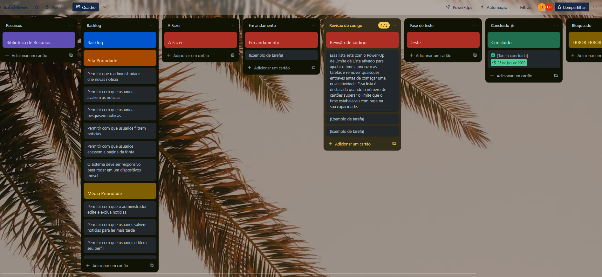

# Introdução

Informações básicas do projeto.

* **Projeto:** ValidNews
* **Repositório GitHub:** (https://github.com/ICEI-PUC-Minas-PPLES-TI/plf-es-2025-1-ti1-0385100-valid-news)
* **Membros da equipe:**

  * João Victor França ([GIT HUB](https://github.com/Franca0118))
  * Carlos Eduardo Pamponet Porto Lima ([GIT HUB](https://github.com/Carlos-Eduardo-Pamponet))


A documentação do projeto é estruturada da seguinte forma:

1. Introdução
2. Contexto
3. Product Discovery
4. Product Design
5. Metodologia
6. Solução
7. Referências Bibliográficas

✅ [Documentação de Design Thinking (MIRO)](files/processo-dt.pdf)

# Contexto

Hoje em dia vivemos com um gigantesco excesso de informação, com isso, as notícias chegam de forma rápida e massiva por diversas fontes. Nosso projeto tem como princiapal objetivo conectar pessoas que buscam combater a parcialidade das notícias, criando um espaço onde possam se comunicar, colaborar e ajudar uns aos outros a identificar, classificar e destacar as melhores e piores informações divulgadas pela mídia.

Com o aumento de casos de manipulação de fatos e a dificuldade de encontrar noticias imparciais e de qualidade, é essencial oferecer ferramentas oferecer a aqueles que buscam noticias uma forma de serem mais críticos e ativos no consumo de notícias, de modo com que possam criar discuções e avaliar as noticias de acordo com sua propria opinião.

Nosso público-alvo são todas as pessoas interessadas em se manter bem informadas, com acesso a notícias mais imparciais, confiáveis e contextualizadas, sendo desde de quem lê noticias raramente até aquele que tem horarios pre defenidos para ler.

## Problema

Imparcialidade de notícias e jornalismo

Hoje em dia, vivemos em um mundo onde temos toda a informação do mundo em nossos bolsos. Com as inúmeras fontes de notícias, o acesso às notícias acaba sendo massivo e instantâneo, com isso, passamos a enfrentar desafios, como por exemplo: distinguir notícias confiáveis, identificar notícias que não sofreram manipulações para agradar terceiros e a identificação de notícias feitas para enganar o leitor. É notavel a existencia de uma dificuldade para que os leitores possam se manter atualizados com as notícias do dia.

## Objetivos

O ValidNews é uma plataforma que possibilita o próprio leitor a avaliar sua percepção sobre o quão tendenciosa é uma notícia. Desse modo, com base nas avaliacões de leitores passados, se consegue decidir qual notícia ler sabendo que já foi julgada como “verdadeira”.

## Justificativa

Como observado nas entrevistas, "Eu já vi varias pessoas distorcerem notícias a seu favor, apenas para criar
um discurso de ódio contra certos grupos de pessoas, e portais de notícias ajudam a alimentar a visão dessas pessoas.", é notavel a dificulade dos leitores em distinguir notícias confiáveis, diferenciar notícias que não sofreram manipulações para agradar terceiros ou identificar notícias feitas para enganar o leitor. Entrevistados dizem presenciar o uso do meio jornalístico por terceiros em busca de certa aprovação ou covencimento, como por exemplo na politica para fazerem propagandas politicas a seu favor.

Noticias parciais acabam afetando na vida pessoal dos leitores, como dito em nossas entrevistas "A imparcialidade impacta em diversos assuntos considerados polêmicosna visão das pessoas, muitas vezes chegando a nos odiar e nos desentendermos, por terem uma visão errada devido a pedaços de informações tiradas de contexto." levando a pessoa a acreditar em informações manipuladas para agrado politico

Com o aumento de casos de manipulação de fatos e a dificuldade de encontrar noticias imparciais e de qualidade, é essencial oferecer ferramentas a aqueles que buscam noticias uma forma de serem mais críticos e ativos no consumo de notícias, de modo com que possam criar discuções e avaliar as noticias de acordo com sua propria opinião.

## Público-Alvo

Nosso público-alvo são todas as aquelas pessoas interessadas em se manter bem informadas com acesso a notícias mais imparciais, confiáveis e contextualizadas, sendo desde de quem lê noticias raramente até aquele que tem horarios pre defenidos para ler.

# Product Discovery

## Etapa de Entendimento

-> Matriz CSD
 <br>

-> Mapa de stakeholders
 <br>

-> Entrevistas qualitativas


-> Highlights de pesquisa

 <br>

 <br>

## Etapa de Definição

### Personas

<br>
<br>

# Product Design

Nesse momento, vamos transformar os insights e validações obtidos em soluções tangíveis e utilizáveis. Essa fase envolve a definição de uma proposta de valor, detalhando a prioridade de cada ideia e a consequente criação de wireframes, mockups e protótipos de alta fidelidade, que detalham a interface e a experiência do usuário.

## Histórias de Usuários

Com base na análise das personas foram identificadas as seguintes histórias de usuários:

| EU COMO...`PERSONA` | QUERO/PRECISO ...`FUNCIONALIDADE`        | PARA ...`MOTIVO/VALOR`               |
| --------------------- | ------------------------------------------ | -------------------------------------- |
| Administrador         | Registrar novas noticias      | Para que os usuarios possam usa-las no sistema |
| Administrador         | Excluir uma noticia      | Para em casos de erros na criação ou problemas, a noticia possa ser excluida |
| Administrador         | Editar uma noticia      | Para que em erros na criação da noticia ela possa ser editada para a correção |
| Administrador         | Ocultar usuarios      | Para evitar usos indevidos da plataforma |
| Usuário do sistema   | Avaliar uma noticia | Para compartilhar suas opniões com os outros usuarios |
| Usuário do sistema   | Ver as noticias em alta com facilidade | Para sempre estar em dia com noticias em alta |
| Usuário do sistema   | Ter como pesquisar por uma notcia | Poder pesquisar sobre uma noticia do meu gosto pessoal, ou que não consegui encontrar logo de cara |
| Usuário do sistema   | Ter acesso a pagina da fonte da noticia | Para ler a noticia, e saber sobre sua fonte|
| Usuário do sistema   | Conseguir filtrar noticias com base nos meus gostos pessoais | Para não usar a plataforma somente para os conteudos bombasticos, ter como ver noticias do meu interesse pessoal, como futebol |
| Usuário do sistema   | Editar meu perfil | Para que eu possa  |

## Proposta de Valor

##### Proposta para Persona Gabriel

 <br>

##### Proposta para Persona Joana


## Requisitos

As tabelas que se seguem apresentam os requisitos funcionais e não funcionais que detalham o escopo do projeto.

### Requisitos Funcionais

| ID     | Descrição do Requisito                                   | Prioridade |
| ------ | ---------------------------------------------------------- | ---------- |
| RF-001 | Permitir que o administradaor crie novas noticia | ALTA       |
| RF-002 | Permitir com que o administrador edite e exclua noticias | MÉDIA     |
| RF-003 | Permitir com que usuarios avaliem as noticias | ALTA     |
| RF-004 | Permitir com que usuarios pesquisem notiicas | ALTA     |
| RF-005 | Permitir com que usuarios filtrem noticias | ALTA     |
| RF-006 | Permitir com que usuarios salvem noticias para ler mais tarde | MÉDIA     |
| RF-007 | Permitir com que usuarios acessem a pagina da fonte | ALTA     |
| RF-008 | Permitir com que usuarios editem seu perfil | MÉDIA     |
| RF-009 | Permitir com que usuarios denunciem outros usuarios | MÉDIA     |

### Requisitos não Funcionais

| ID      | Descrição do Requisito                                                              | 
| RNF-001 | O sistema deve ser responsivo para rodar em um dispositivos móvel | ALTA     |
| RNF-002 | Deve processar requisições do usuário em no máximo 3s | BAIXA      |
| RNF-003 | O sistema deve ter um layout agradavel ao usuario | MEDIA      |
| RNF-003 | O sistema deve previniar ao maximo falhas | MEDIA      |

## Projeto de Interface

Artefatos relacionados com a interface e a interacão do usuário na proposta de solução.

### Wireframes

Estes são os protótipos de telas do sistema.

Tela de Login 

Página Principal 


Página de resultado de Pesquisa


Página com as notícias Tendenciosas 

Página com as notícias mais vistas 

Página do Fórum para os úsuarios conversarem 

Página da Notícia


### User Flow


### Protótipo Interativo

[Protótipo Interativo (MarvelApp)](https://marvelapp.com/prototype/1c0d9j5e)

# Metodologia
O grupo utilizou da plataforma Miro para organizar o Processo de Design Thinking, onde ergueu o problema que seu projeto buscava solucionar, a Parcialidade nas Notícias.  

Dúvidas, Certezas e Suposições foram erguidas, assim como foi criado um mapa de stakeholders para sabermos quem influenciaria o problema. Logo após uma série de entrevistas curstas foram conduzidas ao que foi identificado como Público Alvo, totalizando pouco mais de 11 entrevistados.  

As falas mais signifcativas dos entrevistados, assim como os aspectos de maior importância, os principais temas e aprendizados e também novos tópicos para explorar no futuro foram erguidos com base na informação coletada.  

A seguir, 4 Personas fictícias foram criadas, baseadas no perfil de alguns dos entrevistados. Uma ideia geral e resumida de suas vidas foi descrita, suas posses relevantes ao problema, e seus objetivos em alcançar uma soluição ao problema. Quais os compromissos que limitam essa pessoa a resolver o problema, quais complicações surgem desses compromissos, e quais seriam os ganhos advindos de solucionar o problema da parcialidade das notícias também foi informada em _bulletpoints_.  
Os _devs_ imaginaram como os leitores viriam a solucionar o problema pelo método de História de Usuários. Cada necessidade foi listada separadamente assim como seu objetivo.  
Após isso, cada _dev_ propôs uma solução que atenderia à todas essas tarefas. Subsequentemente, cada solução foi incrementada pelo _dev_ adjacente, totalizando 4 soluções possíveis que foram expandindas em 6 posteriormente.  
Essas soluções foram descritas em mural de possiblidades, e detalhadas e um pequeno parágrafo. Um Plano Cartesiano foi construído para posicionar as soluções em termos de impacto e custo, onde foi decidido que um **Site de Recomendações** seria a solução que o grupo desenvolveria, por seu baixo custo e alto impacto.  
O Grupo então se reuniu na ferramento do Github. Onde a documentação do projeto foi escrita no modelo que vê aqui. Foi transcrita uma [descrição simples do problema](README.md#problema), o [Objetivo do Projeto](README.md#objetivos), a [razão pelo desenvolvimento do projeto](README.md#justificativa) e seu [Público Alvo](README.md#público-alvo).  
As [Especificações do Projeto](README.md#requisitos) foram detalhadas por [João](https://github.com/Franca0118) com base nas [Histórias de Usuário](README.md#histórias-de-usuários) e uma proposta de site foi elaborada por [Carlos](https://github.com/Carlos-Eduardo-Pamponet) com uma sequência de [Userflow](README.md#user-flow), uma proposta de [Wireframe](README.md#wireframes), e um [Protótipo Interativo](https://marvelapp.com/prototype/1c0d9j5e).  
Então, o grupo se dividiu para desenvolver o site utilizando a metodologia Sprint. O backlog do produto foi construído com base nos requisitos e o controle de tarefas foi realizado na plataforma Trello por via de um quadro Kanban.  

## Ferramentas

Relação de ferramentas empregadas pelo grupo durante o projeto.

| Ambiente                    | Plataforma | Link de acesso                                     |
| --------------------------- | ---------- | -------------------------------------------------- |
| Processo de Design Thinking | Miro       | https://miro.com/app/board/uXjVIMgj92A=/           |
| Repositório de código       | GitHub     | https://github.com/ICEI-PUC-Minas-PPLES-TI/plf-es-2025-1-ti1-0385100-imparcialidade-de-noticias-e-jornalismo  |
| Hospedagem do site          | Render     | https://valid-news.onrender.com/                   |
| Protótipo Interativo        | MarvelApp  | https://marvelapp.com/prototype/1c0d9j5e           |

## Gerenciamento do Projeto

Divisão de papéis no grupo e apresentação da estrutura da ferramenta de controle de tarefas (Kanban).



# Solução Implementada

Esta seção apresenta todos os detalhes da solução criada no projeto.

## Vídeo do Projeto

O vídeo a seguir demonstra as funcionalidades do Valid News

[Link do Video](https://github.com/ICEI-PUC-Minas-PPLES-TI/plf-es-2025-1-ti1-0385100-valid-news/blob/News-Page/docs/images/Valid%20News%20video.mp4)

## Funcionalidades

Esta seção apresenta as funcionalidades da solução.Info

##### Funcionalidade 1 - Cadastro de Notícias

Permite a inclusão, leitura, alteração e exclusão de notícias para o sistema

* **Estrutura de dados:** [Noticias]([#ti_ed_contatos](https://github.com/ICEI-PUC-Minas-PPLES-TI/plf-es-2025-1-ti1-0385100-valid-news/blob/News-Page/codigo/db/db.json))
* **Instruções de acesso:**
  * Abra o site e efetue o login como adm
  * Acesse o menu principal e escolha a opção Cadastros
* **Tela da funcionalidade**:


##### Funcionalidade 2 - Main Page

Permite a visualização de todas as notícias cadastradas 

* **Estrutura de dados:** [Noticias]([#ti_ed_contatos](https://github.com/ICEI-PUC-Minas-PPLES-TI/plf-es-2025-1-ti1-0385100-valid-news/blob/News-Page/codigo/db/db.json))
* **Instruções de acesso:**
 *  Abra o site e efetue o login
* **Tela da funcionalidade**:
  


##### Funcionalidade 3 - News Page

Permite a visualização de uma notícia cadastrada 

* **Estrutura de dados:** [Noticias](https://github.com/ICEI-PUC-Minas-PPLES-TI/plf-es-2025-1-ti1-0385100-valid-news/blob/News-Page/codigo/db/db.json)
* **Instruções de acesso:**
 *  Abra o site e efetue o login
 *  Acesse uma notícia
 *  Faça um Comentário
* **Tela da funcionalidade**:


##### Funcionalidade 4 - Cadastro de Comentários

Permite a visualização e o cadastro de comentários em uma notícia 

* **Estrutura de dados:** [comentarios](https://github.com/ICEI-PUC-Minas-PPLES-TI/plf-es-2025-1-ti1-0385100-valid-news/blob/News-Page/codigo/db/db.json)
* **Instruções de acesso:**
 *  Abra o site e efetue o login
 *  Acesse uma notícia
* **Tela da funcionalidade**:


##### Funcionalidade 5 - Pesquisa

Permite a Pesquisa de uma notícia especifica  

* **Estrutura de dados:** [noticias](https://github.com/ICEI-PUC-Minas-PPLES-TI/plf-es-2025-1-ti1-0385100-valid-news/blob/News-Page/codigo/db/db.json)
* **Instruções de acesso:**
 *  Abra o site e efetue o login
 *  Acesse a barra de pesquisa
* **Tela da funcionalidade**:


##### Funcionalidade 6 - Filtragem

Permite a Filtragem de notícias  

* **Estrutura de dados:** [noticias](https://github.com/ICEI-PUC-Minas-PPLES-TI/plf-es-2025-1-ti1-0385100-valid-news/blob/News-Page/codigo/db/db.json)
* **Instruções de acesso:**
 *  Abra o site e efetue o login
 *  Acesse a barra de Filtros
* **Tela da funcionalidade**:


## Estruturas de Dados

Descrição das estruturas de dados utilizadas na solução com exemplos no formato JSON.Info

##### Estrutura de Dados - Notícias

Notícias da aplicação

```json
 {
      "id": "fb0b",
      "data": "2025-06-25",
      "titulo": "c",
      "thumb": "http://localhost:3000/modulos/cadastro/Cad_News.html",
      "categoria": "http://localhost:3000/modulos/cadastro/Cad_News.html",
      "texto": "http://localhost:3000/modulos/cadastro/Cad_News.html",
      "autor": "http://localhost:3000/modulos/cadastro/Cad_News.html",
      "fonte": "http://localhost:3000/modulos/cadastro/Cad_News.html",
      "mediaAvaliacoes": null,
      "numAvaliacoes": 0,
      "acessos": 2
}
  
```

##### Estrutura de Dados - Usuários

Registro dos usuários do sistema utilizados para login e para o perfil do sistema

```json
  {
      "id": "3dbc",
      "login": "joao2",
      "senha": "joao2",
      "nome": "joao2",
      "email": "joao2"
    }
```

## Módulos e APIs

Esta seção apresenta os módulos e APIs utilizados na solução

**Fonts:**

* IconsFinder - [https://www.iconfinder.com](https://www.iconfinder.com)

**Scripts:**

* Node.js - [https://nodejs.org/pt](https://nodejs.org/pt)
* Bootstrap 4 - [http://getbootstrap.com/](http://getbootstrap.com/)

# Referências

As referências utilizadas no trabalho foram:

* Bootstrap 4 - [http://getbootstrap.com/](https://getbootstrap.com/docs/5.3/getting-started/introduction/)
* W3Schools - [https://www.w3schools.com](https://www.w3schools.com)
